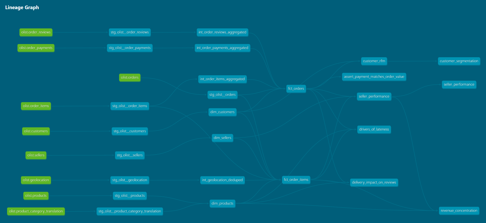
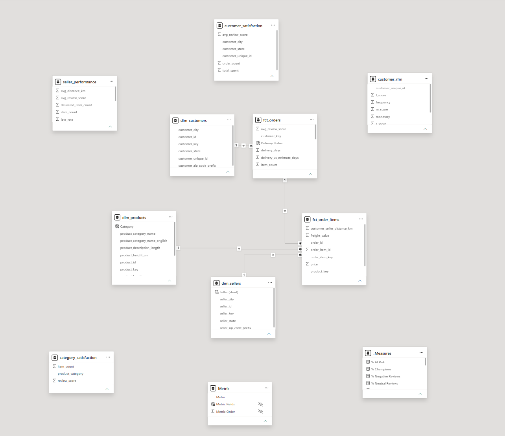
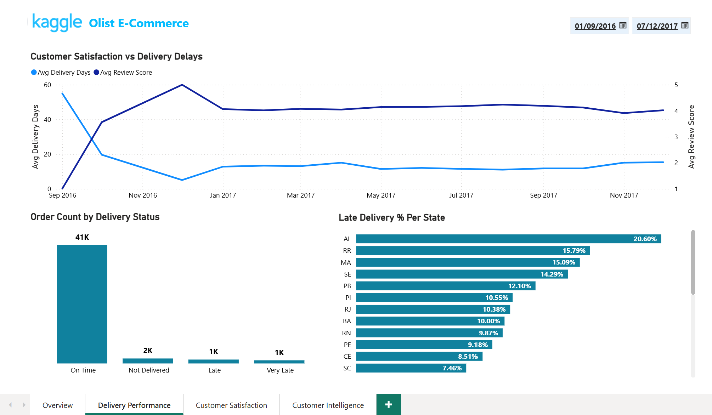
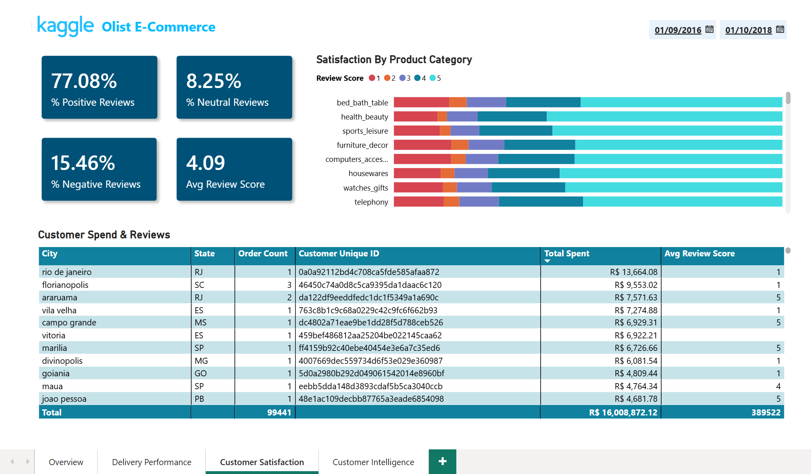
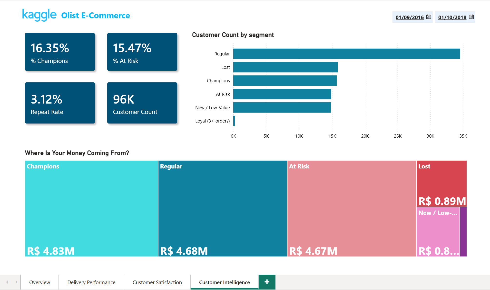

# Brazilian E-Commerce Analytics (dbt + DuckDB)


An end-to-end analytics engineering project on the public [Olist](https://www.kaggle.com/datasets/olistbr/brazilian-ecommerce) Brazilian e-commerce dataset (~100k orders across 9 related tables). It builds a tested, documented dbt project on a Kimball star schema, then uses that model to answer real business questions. Every insight is framed as finding, evidence, impact, and recommendation.

The emphasis is on what matters in production analytics: correct grain, surrogate keys and referential tests, honesty about the data's limitations, and conclusions that separate correlation from causation.

## Contents

- [What this demonstrates](#what-this-demonstrates)
- [The dataset and its limitations](#the-dataset-and-its-limitations)
- [Architecture](#architecture)
- [Project structure](#project-structure)
- [Testing](#testing)
- [Insights](#insights)
- [Dashboard](#dashboard)
- [Scope and deliberate exclusions](#scope-and-deliberate-exclusions)
- [How to run](#how-to-run)
- [What I would add for a team](#what-i-would-add-for-a-team)

## What this demonstrates

- A 3-layer dbt project: staging, intermediate, marts (22 models, 79 tests, 9 sources).
- A Kimball star schema: 3 dimensions and 2 fact tables at different grains, joined on surrogate keys with `relationships` tests enforcing referential integrity.
- Generic tests (`unique`, `not_null`, `accepted_values`, `relationships`, `dbt_utils` composite and range tests) plus a singular data-quality test run at WARN severity.
- Five analyses that go beyond description: a confounder-controlled delivery study, customer RFM segmentation with window functions, and seller and category revenue-concentration work.
- A four-page Power BI dashboard built on the marts (Overview, Delivery Performance, Customer Satisfaction, Customer Intelligence) that presents the findings for a business audience.
- Deliberate scoping: documented decisions about what was *not* built, and why.

## The dataset and its limitations

Olist is a real marketplace export, so it is messy in the ways production data usually is. Three limitations are handled explicitly rather than ignored:

1. **No true cost or margin.** The data has `price`, `freight_value`, and `payment_value`, but no cost of goods. No profit or margin is computed; all revenue figures are gross merchandise value (item price).
2. **`customer_id` is per-order, not per-person.** Olist issues a new `customer_id` for every order. The real person is `customer_unique_id`. All person-level analysis (RFM, repeat rate) uses `customer_unique_id`; `customer_id` is treated as a per-order key only.
3. **Low repeat rate.** Only about 3% of customers order more than once, which bounds what retention and frequency analysis can claim. This is stated wherever it matters and drives a deliberate modelling decision (see [Scope and deliberate exclusions](#scope-and-deliberate-exclusions)).

## Architecture



*Full project lineage rendered by `dbt docs`: green source tables, then `stg_olist__*`, the `int_*` aggregations, the star schema, and the analytical marts and analyses on the right.*

- **Staging** materialises as views, one model per source, with empirical type handling (for example, dates cast to `DATE` only where no row carries a time component).
- **Intermediate** holds order-grain aggregations of items, payments, and reviews, plus a geolocation model that deduplicates Brazil's zip-prefix coordinates to a single centroid per prefix.
- **Marts** materialise as tables. The star schema uses surrogate keys from `dbt_utils.generate_surrogate_key`; facts reference dimensions through those keys, with `relationships` tests verifying every key resolves. `fct_order_items` also carries a customer-to-seller great-circle (haversine) distance built from the deduplicated geolocation.

## Project structure

```text
.
├── models/
│   ├── staging/          # stg_olist__*  (views, one per source)
│   ├── intermediate/     # int_*  (order-grain aggregations, geolocation dedup)
│   └── marts/            # star schema (fct_*, dim_*) plus purpose-built analysis marts
├── analyses/             # the five business analyses (compiled, read the built marts)
├── tests/                # singular data-quality test
├── powerbi/              # marts-export script and the Power BI dashboard (.pbix)
├── docs/
│   └── images/           # DAG, Power BI model view, dashboard screenshots
├── dbt_project.yml
├── packages.yml
└── README.md
```

## Testing

- **Generic tests** on keys and categoricals: `unique` and `not_null` on every surrogate key, `accepted_values` on statuses and scores, `relationships` on all fact-to-dimension keys, and `dbt_utils.unique_combination_of_columns` for composite grains.
- **A singular data-quality test** (`tests/assert_payment_matches_order_value.sql`) reconciles each order's payment against item price plus freight. It runs at **WARN** severity because the mismatches are legitimate Brazilian payment mechanics (installment interest and vouchers), not ingestion errors. It surfaces them rather than failing the build.
- Dimensions are SCD Type 1 (overwrite). In production these would be snapshotted for SCD Type 2 history.

## Insights

Five analyses that go beyond description. Each is framed as finding, evidence, impact, and recommendation, and reads from the built marts in `/analyses`.

| # | Question | Headline finding |
|---|----------|------------------|
| 1 | Does late delivery hurt satisfaction? | Missing the promised date drops review score by about 2.5 stars, and the effect survives category, weight, and distance controls. |
| 2 | What drives lateness? | Distance, not product or seller quality. Late rate more than doubles from short to long routes. |
| 3 | Where is revenue concentrated? | On sellers, not categories. The top 10% of sellers drive 67.6% of GMV. |
| 4 | How is customer value distributed? | Concentrated by value, but about 97% of customers buy once, so RFM is descriptive, not a retention funnel. |
| 5 | Does payment reconcile to order value? | 387 orders (about 0.4%) mismatch, all explained by installment interest and vouchers. |

All numbers below are produced by the analyses in `/analyses`, which read the built marts.

### 1. Late delivery is associated with lower review scores

- **Finding:** missing the promised delivery date is associated with a sharp drop in review score, roughly 2.5 stars.
- **Evidence:** average review by delivery-vs-estimate bucket: early 4.29, on-time 4.04, 1-5 days late 2.99, 6-15 days late 1.74, 15+ days late 1.73. The drop is steady and sharpest at the on-time to slightly-late boundary. Arriving early beats arriving exactly on time.
- **Robustness:** the same drop holds within product categories, within weight bands, and within distance bands. Distance has a small effect of its own (about 0.1 star across the range), but lateness is roughly twenty times larger and survives all three controls. Association is defensible; causation is not claimed (seller and price are uncontrolled).
- **Impact:** late orders are only about 6.7% of volume but generate most of the 1 and 2 star reviews dragging the platform rating.
- **Recommendation:** optimise for hitting the promised date, not raw speed. Most orders already arrive early, so the focus is the small share of late orders: realistic estimates and flagging shipments likely to be late, especially long-distance ones.

### 2. Lateness is driven by distance, not product or seller quality

- **Finding:** the drivers of lateness are structural and geographic.
- **Evidence:** late rate climbs with customer-to-seller distance, from 4.5% under 100km to 10.3% beyond 1000km. It spikes occasionally (12.4% in November 2017 around Black Friday, and an unusual 19.0% in March 2018). Weight matters only for the 10kg+ tail. Category is negligible (6.3% to 8.0% across all). Sellers are spread, not concentrated: of 881 sellers with 20 or more delivered items, only 11 are chronically late.
- **Impact and recommendation:** the most effective fix is shortening long routes (fulfilling from the nearest seller), then adding capacity and widening estimates around known peaks. Coaching the roughly 166 sellers in the 10-25% late band is worthwhile; removing sellers in bulk is not, because the always-late group is tiny.

### 3. Revenue concentrates on sellers, not categories

- **Finding:** revenue risk is a supply-side (seller) story, not a demand-side (category) one.
- **Evidence:** the top 10% of sellers (310 of 3,095) drive 67.6% of GMV, the top 20% reach 82.7%, and the bottom half of sellers contribute about 2% combined. Revenue is spread across categories: no single category exceeds 9.3% of revenue, the top 5 are about 40%, and it takes roughly 20 of the 72 categories to reach 80%.
- **Recommendation:** treat the top few hundred sellers as key accounts, since retention there protects two-thirds of GMV. Category strategy can stay broad because no single category dominates. Seller quality does not vary with size, so there is no reason to limit larger sellers.

### 4. Customer value is concentrated, but the base is one-time buyers

- **Finding:** RFM segments concentrate value, but the dataset is dominated by single purchases.
- **Evidence:** about 97% of customers order exactly once, so the Frequency dimension carries little signal and Recency and Monetary do the work (Frequency is tiered with `CASE`, not `NTILE`, for that reason). Champions are 16.4% of customers but 30.2% of revenue; At-Risk are 15.5% of customers but 29.2% of revenue.
- **Recommendation:** the segments are descriptive value tiers, useful for prioritising marketing spend, not a live retention funnel. The At-Risk revenue figure is limited because most one-time buyers will not return.

### 5. Data quality: payment reconciliation

- **Finding:** 387 orders (about 0.4%) have a payment total that does not equal item price plus freight.
- **Evidence:** 294 are overpaid (average +R$10.44, consistent with installment interest) and 93 are underpaid (average -R$2.15, consistent with vouchers and discounts).
- **Handling:** captured by a singular test at WARN severity. These are real payment mechanics, so the right behaviour is to surface and explain them, not to fail the build.

## Dashboard

A four-page Power BI dashboard built directly on the dbt marts. It presents the findings above for a business audience and adds interactivity: a synced date filter and a revenue/orders toggle that drives several visuals at once.

The transactional pages read the star schema. Two small purpose-built marts, `customer_satisfaction` and `category_satisfaction`, were added to co-locate review score with customer spend and with product category, which the star schema keeps on separate tables at different grains. A wide analysis mart is the right way to cross those grains rather than forcing bidirectional relationships in the BI layer. It is the same judgement made elsewhere in the project: a star schema for the transactional model, and purpose-built marts where a question needs a different grain.

The model loaded into Power BI is the dbt star schema itself: fact tables joined to their dimensions on surrogate keys, one-to-many and single-direction. The aggregate marts sit alongside as standalone sources for their own pages.



**Overview.** Headline KPIs, a revenue trend shown alongside average review score, and top sellers and categories with a revenue/orders toggle.


**Delivery Performance.** On-time and late rates, the delivery-status split, and late rate over time and by state. The operational view behind insight 2.



**Customer Satisfaction.** Review score by delivery outcome (the cascade from insight 1), the review-score mix by product category, and a table of high-spending, low-satisfaction customers worth retaining.



**Customer Intelligence.** The RFM segmentation from insight 4: where revenue comes from by segment, and a recency-versus-spend customer landscape.



## Scope and deliberate exclusions

Two things were deliberately not built, and the reasoning is part of the work:

- **No churn, lifetime-value, or retention model.** A roughly 3% repeat rate cannot support a reliable churn or CLV model: with about 97% of customers having a single order, there is no repeat-behaviour signal to learn from. RFM here is descriptive segmentation, not a retention funnel.
- **No profit or margin.** With no cost of goods in the source, any margin figure would be invented. All revenue is gross merchandise value, stated as such.

## How to run

The warehouse is DuckDB, so the whole project builds locally with no cloud account.

**Prerequisites:** [uv](https://docs.astral.sh/uv/), and the Olist CSVs in `/data` (gitignored, Kaggle slug `olistbr/brazilian-ecommerce`).

```bash
# 1. install dependencies and dbt packages
uv sync
uv run dbt deps

# 2. build and test (runs every model, then every test)
uv run dbt build

# 3. generate the docs site and lineage graph
uv run dbt docs generate
uv run dbt docs serve
```

`olist.duckdb` and `/data` are gitignored, so a fresh clone needs the CSVs in place before the first build.

## What I would add for a team

This is a static, single-author project, so it does not include production monitoring. On a team it would also have:

- `sqlfluff` and pre-commit hooks for style and lint on every commit.
- `dbt-checkpoint` and `dbt-project-evaluator` to enforce documentation and best-practice coverage.
- A CI workflow running `dbt build` and lint on every pull request.
- Model `contracts` on the public marts.
- Elementary plus alerting for production runs.

Each of these is worth adding once more than one person depends on the project; on a solo project like this they would be overkill.
